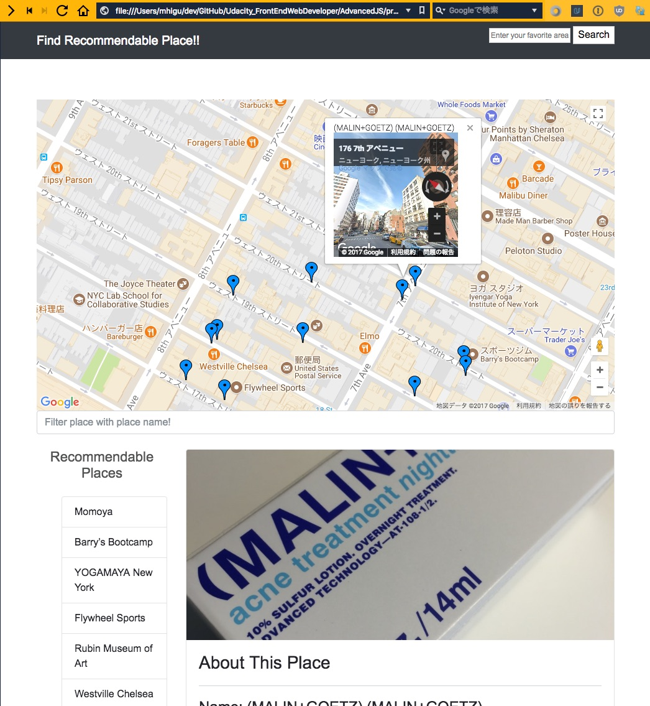

# Project Overview



I will develop a single page application featuring a map of your neighborhood or a neighborhood you would like to visit. I will then add functionality to this map including highlighted locations, third-party data about those locations and various ways to browse the content.

## How it runs

The required libraries or framewi]ork are already placed in this repository. So you need to do is only execute these command to run my project.

```bash
# clone repository
git clone https://github.com/mhigu/Udacity_FrontEndWebDeveloper.git
# Move project root
cd Udacity_FrontEndWebDeveloper/AdvancedJS/project/NeighborhoodMap
# Open html in browser
open src/html/index.html

# it will show up!
```

## Why this Project

The neighborhood map application is complex enough and incorporates a variety of data points that it can easily become unwieldy to manage. There are a number of frameworks, libraries and APIs available to make this process more manageable and many employers are looking for specific skills in using these packages.

## What I Learn

I will learn how design patterns assist in developing a manageable codebase. I’ll then explore how frameworks can decrease the time required developing an application and provide a number of utilities for you to use.

## External Resource

### 

* [Google map API](https://developers.google.com/maps/)
* [Foursquare](https://developer.foursquare.com/)