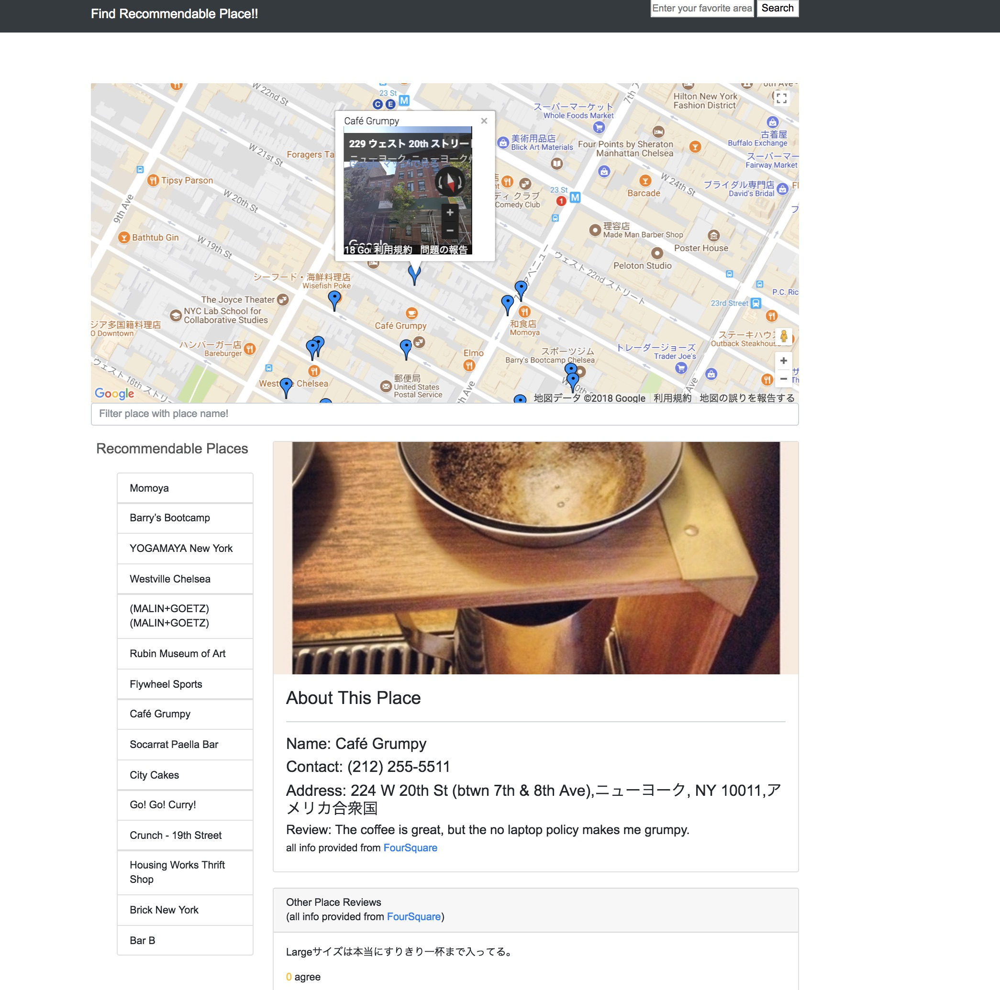

# About This Repository

This repository is for Udacity Front End Developer nano degree program.

**Whaht is Udacity Front End Developer**

see this link. [Udacity Front End Developer](https://www.udacity.com/course/front-end-web-developer-nanodegree--nd001)

## Project Outcomes

There are five main outcomes (in detail, there are more) in different three part. Those are pused into this repository as each directory.

Just simple description for those are bellow.

## JavaScript Foundations

Create static responsive web page with HTML/CSS to learn what is responsive web site and how to create it.

### Technical terms

* [HTML/CSS](https://developer.mozilla.org/en-US/docs/Web)
* [Bootstrap](https://getbootstrap.com)

---

## Intermediate JavaScript

Create simple application using HTML/CSS and JavaScript to learn technical matters which was used so far.

### Pixel Art Marker

### Memory Game

### Classic Arcade Game Clone

### Technical terms

* [HTML/CSS](https://developer.mozilla.org/en-US/docs/Web)
* [Bootstrap](https://getbootstrap.com)
* [JavaScript](https://developer.mozilla.org/en-US/docs/Web/JavaScript)
* [jQuery](http://jquery.com/)
* [Jasmine](https://jasmine.github.io/)
* [Canbas](https://developer.mozilla.org/ja/docs/Web/HTML/Canvas)

---

### AdvancedJS

Create SPA using web application framework(Knockout.js) and third party APIs to wrap up all the skills what I learned in this program.

### Neighborhood Map

### Technical terms

* [HTML/CSS](https://developer.mozilla.org/en-US/docs/Web)
* [Bootstrap](https://getbootstrap.com)
* [JavaScript](https://developer.mozilla.org/en-US/docs/Web/JavaScript)
* [Knockout.js](http://knockoutjs.com)
* [Google Maps API](https://developers.google.com/maps/documentation/javascript/)
* [Foursquare](https://developer.foursquare.com/)